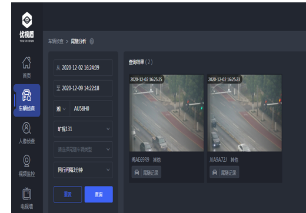

#### **思考车辆四个场景的方案**

1、区域碰撞分析：分析不同的时间段与区域组间（区域中的设备）均出现的车辆。（每次最多分析5个区域，每个时间段最多24小时，返回结果最多1000条结果）

`关键算法`：不同的t1~t2,卡口下车牌数据，把5个list中的车牌号拿出来求交集，考虑方法：bitmap、bloom filter

```java
使用RoaringBitmap进行模拟5千万数据，求交集只需5ms左右完成。
    
		TimeUtils.now();
        List<RoaringBitmap> lists=new ArrayList<>();

        RoaringBitmap rr1 = new RoaringBitmap();
        RoaringBitmap rr2 = new RoaringBitmap();
        RoaringBitmap rr3 = new RoaringBitmap();
        RoaringBitmap rr4 = new RoaringBitmap();
        RoaringBitmap rr5 = new RoaringBitmap();

        rr1.add(1L,10000000L);
        rr2.add(9999995L,20000000L);
        rr3.add(9999995L,30000000L);
        rr4.add(9999995L,40000000L);
        rr5.add(9999995L,50000000L);
        lists.add(rr1);
        lists.add(rr2);
        lists.add(rr3);
        lists.add(rr4);
        lists.add(rr5);
        for (int i = 1; i < lists.size(); i++) {
            lists.get(0).and(lists.get(i));
        }
        System.out.println(lists.get(0));
        System.out.println("耗时："+TimeUtils.timeInterval()+" ms");

```

```bash
{9999995,9999996,9999997,9999998,9999999}
耗时：22 ms
```

方案一：全拿出来 只取车牌列，(hbase scan 根据rowkey确定范围，在进行单列过滤，效率较快，68000耗时：5159ms；68000耗时：10578ms【rowkey确定范围,返回全字段】)flink 去重，交集。


方案二：数据存一份es,按照时间和卡口快速查询，转换为stream，取bitmap交集


2、套牌车分析：没有输入指定车牌，分析当前时间段内同号车身颜色不同  或  同号车辆类型不同  或  同号车辆品牌不同  或  同号短时异地出没  的车辆信息。（返回最多1000条结果）

`关键算法`：t1~t2 有很多分组的轨迹数据，按照车牌分组（keyby），，对每个分组寻找不同的属性（颜色、类型、品牌、短时异地出没）

快速分组算法，组内（list）寻找属性不同的算法

最终方案：
	


3、入城统计：先查询开始与结束时间段内经过选择的入城卡口的所有车辆，然后分析入城开始时间往前推X天这个时间段都没出现过的车辆，则认为是首次入城。（开始结束时间段最多30天，回溯时长最多30天，返回最多1000条结果）

`关键算法`：t1~t2 的卡口（可以选取多个），进行车牌分组，使用卡口时间-回溯时间在t1~t2之内，没出现过就是首次入城


4、尾随分析：根据目标车辆过车的前后时间，经过的地点（可多选设备），找到目标车辆的尾随车辆。（结果返回最多1000条结果）



`实现思路`：

1) 建立如下索引结构：k1...kN为卡口ID，即DeviceID, kN对应的值为该车经过该卡口时的拍照时间，即shotTime，时间按顺序排列好，该索引可按月创建，id字段为车牌唯一ID。模拟数据如下所示：
<pre>
     {
    	"id":4,
    	"plateNo" : "car4",
    	"k1" : [
            3,
            13,
            23,
            33
            ],
    	"k2" : [
            4,
            14,
            24,
            34
            ],
    	"k6" : [
            16,
            26,
            36,
            46
            ]
    }
</pre>
2) 运用bool query 来查询经过卡口为k1,k2,k3的车辆，使用minimum_should_match来控制必须经过的卡口数量；并使用must_not排除掉被尾随车辆本身。
<pre>
{
  "query": {
    "bool": {
      "should": [
        {
          "exists": {
            "field": "k1"
          }
        },
        {
          "exists": {
            "field": "k2"
          }
        },
        {
          "exists": {
            "field": "k3"
          }
        },
        {
          "exists": {
            "field": "k4"
          }
        }
      ],
      "minimum_should_match": 3,
      "must_not": [
        {
          "term": {
            "plateNo": {
              "value": "car1"
            }
          }
        }
      ]
    }
  }
}
</pre>

3) 用script查询，来过滤数据，把满足时间间隔（如3分钟...10分钟）的数据筛选出来。
<pre>
{
  "query": {
    "bool": {
      "should": [
        {
          "exists": {
            "field": "k1"
          }
        },
        {
          "exists": {
            "field": "k2"
          }
        },
        {
          "exists": {
            "field": "k3"
          }
        },
        {
          "exists": {
            "field": "k4"
          }
        }
      ],
      "minimum_should_match": 3,
      "must_not": [
        {
          "term": {
            "plateNo": {
              "value": "car1"
            }
          }
        }
      ]
    }
  },
  "post_filter": {
    "script": {
      "script": {
        "source":"if(Math.abs(doc['k1'].value -3L) ==0) return true",//todo get doc by id
        "lang": "painless"
      }
    }
  }
}

</pre>


